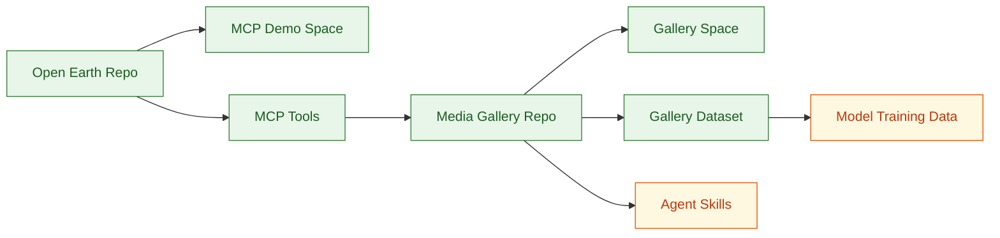

# MCP4RS Asset Map

This file maps the public components of the MCP4RS Open Earth ecosystem.

## Public Assets

| Category | Name | Link | Description |
| --- | --- | --- | --- |
|  | MCP4RS Open Earth | https://github.com/MCP4RemoteSensing/mcp4rs-open-earth | Main MCP server and Gradio app. |
|  | MCP4RS Media Gallery | https://github.com/MCP4RemoteSensing/mcp4rs-media-gallery | Reproducible media-gallery pipeline. |
|  | MCP4RS Open Earth | https://huggingface.co/spaces/zlysunshine/mcp4rs-open-earth | Live MCP server demo. |
|  | MCP4RS Media Gallery | https://huggingface.co/spaces/zlysunshine/mcp4rs-media-gallery | Live use-case gallery demo. |
|  | Media Gallery Outputs | https://huggingface.co/datasets/MCP4RemoteSensing/mcp4rs-media-gallery-outputs | Generated outputs, figures, GIFs, and provenance. |

## Asset Relationship

## Asset Roles

| Asset | What It Is | What It Is Not |
| --- | --- | --- |
| MCP Server Repo | Core source code for the MCP server and Gradio app. | Not a gallery-output dataset. |
| MCP Demo Space | Public web and MCP demonstration of the server. | Not the canonical source repo. |
| Media Gallery Repo | Reproducible workflow for rendering media from source discovery. | Not the core MCP server. |
| Media Gallery Space | Public demonstration of use cases and gallery generation. | Not an operational remote-sensing system. |
| Media Gallery Dataset | Reusable generated media and provenance outputs. | Not a calibrated benchmark dataset. |

## Cross-Linking Checklist

| Location | Links To Add | Status |
| --- | --- | --- |
| `mcp4rs-open-earth` README | Ecosystem repo, MCP demo Space, Media Gallery repo, Media Gallery Space, dataset. | In progress |
| `mcp4rs-media-gallery` README | Ecosystem repo, MCP server repo, MCP demo Space, dataset. | In progress |
| MCP demo Space card | GitHub source repo, ecosystem roadmap, Media Gallery Space. | Planned |
| Media Gallery Space card | Gallery repo, dataset, ecosystem roadmap, MCP server repo. | Planned |
| Dataset card | Gallery repo, Gallery Space, ecosystem roadmap, MCP server repo. | Planned |
