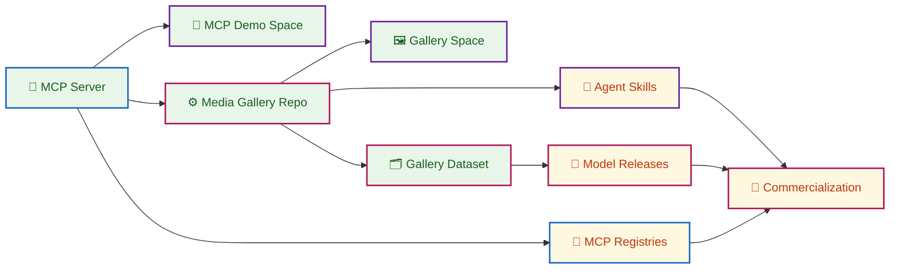

# MCP4RS Open Earth Ecosystem

Public roadmap and asset map for the MCP4RS Open Earth ecosystem: MCP server,
Hugging Face demos, reproducible media gallery, datasets, future Agent Skills,
model releases, registry distribution, and commercialization paths.

## Ecosystem At a Glance

| Category | Asset | Type | Link | Status | Next |
| --- | --- | --- | --- | --- | --- |
| 🧩 Core Platform | MCP4RS Open Earth |  | https://github.com/MCP4RemoteSensing/mcp4rs-open-earth | 🟢 Live | Complete tool-level documentation |
| 🚀 Public Demo | MCP4RS Open Earth Demo |  | https://huggingface.co/spaces/zlysunshine/mcp4rs-open-earth | 🟢 Live | Improve endpoint and client quickstart |
| ⚙️ Workflow Engine | MCP4RS Media Gallery |  | https://github.com/MCP4RemoteSensing/mcp4rs-media-gallery | 🟢 Live | Connect more live MCP-integrated workflows |
| 🖼️ Use-Case Demo | MCP4RS Media Gallery Demo |  | https://huggingface.co/spaces/zlysunshine/mcp4rs-media-gallery | 🟢 Live | Enhance UX and provenance browsing |
| 🗂️ Output Archive | Media Gallery Outputs |  | https://huggingface.co/datasets/MCP4RemoteSensing/mcp4rs-media-gallery-outputs | 🟢 Live | Add richer metadata and examples |
| 🤖 Agent Skills | Skill package roadmap | Planned package | docs/AGENT_SKILLS_PLAN.md | 🟡 Planned | Publish first query -> render -> report skill |
| 🧠 Model Releases | Model release roadmap | Planned package | docs/MODEL_RELEASE_PLAN.md | 🟡 Planned | Select baseline model and evaluation setup |
| 🧭 Registry Distribution | Registry submission roadmap | Planned listing | docs/MCP_PLATFORM_REGISTRATION.md | 🔵 In Progress | Submit metadata package to target registries |
| 💼 Commercialization | Commercialization roadmap | Strategic plan | docs/COMMERCIALIZATION_PLAN.md | 🟠 Exploratory | Define staged service and governance model |
| ➕ Future Categories | Additional ecosystem tracks | ... | ... | ⚪ ... | ... |

Status legend: 🟢 Live | 🔵 In Progress | 🟡 Planned | 🟠 Exploratory | ⚪ Placeholder

## Delivery Status

### 🧩 Core Platform

- [x] Publish MCP4RS Open Earth repository
- [ ] Complete tool-by-tool documentation and examples

### 🚀 Public Demo

- [x] Release MCP demo on Hugging Face Spaces
- [ ] Improve endpoint and client onboarding quickstart

### ⚙️ Workflow Engine

- [x] Open-source Media Gallery workflow repository
- [ ] Add more live MCP-integrated workflow paths

### 🖼️ Use-Case Demo

- [x] Release Media Gallery demonstration Space
- [ ] Enhance UX and provenance exploration

### 🗂️ Output Archive

- [x] Publish outputs dataset with provenance artifacts
- [ ] Expand metadata quality and usage examples

### 🤖 Agent Skills

- [ ] Publish first skill: query -> render -> report

### 🧠 Model Releases

- [ ] Select baseline model and evaluation setup

### 🧭 Registry Distribution

- [ ] Prepare and submit registry metadata package

### 💼 Commercialization

- [ ] Define staged service model and governance guardrails

## Ecosystem Roadmap (Done vs Planned)

Legend:

- ✅ Status fill #E8F5E9 🟩: completed or live assets
- 🗓️ Status fill #FFF8E1 🟨: planned or exploratory assets
- 🧩🧭 Border #1565C0 □🟦: infrastructure and distribution nodes
- 🚀🖼️🤖 Border #6A1B9A □🟪: product and user experience nodes
- ⚙️🗂️🧠💼 Border #AD1457 □🩷: growth, ecosystem, and business nodes

Legend marker note: filled rules use solid color squares; border rules use hollow square markers (□) plus matching color chips.

## Roadmap Documents

| Document | Purpose |
| --- | --- |
| [ROADMAP.md](ROADMAP.md) | Stage-by-stage roadmap with status and immediate priorities. |
| [ASSET_MAP.md](ASSET_MAP.md) | Public asset inventory and relationship map. |
| [docs/AGENT_SKILLS_PLAN.md](docs/AGENT_SKILLS_PLAN.md) | Plan for packaging repeatable workflows as agent-executable skills. |
| [docs/MODEL_RELEASE_PLAN.md](docs/MODEL_RELEASE_PLAN.md) | Model adaptation and release direction from MCP-derived assets. |
| [docs/MCP_PLATFORM_REGISTRATION.md](docs/MCP_PLATFORM_REGISTRATION.md) | Registry listing strategy and readiness checklist. |
| [docs/COMMERCIALIZATION_PLAN.md](docs/COMMERCIALIZATION_PLAN.md) | Sustainable commercialization options with open-science guardrails. |
