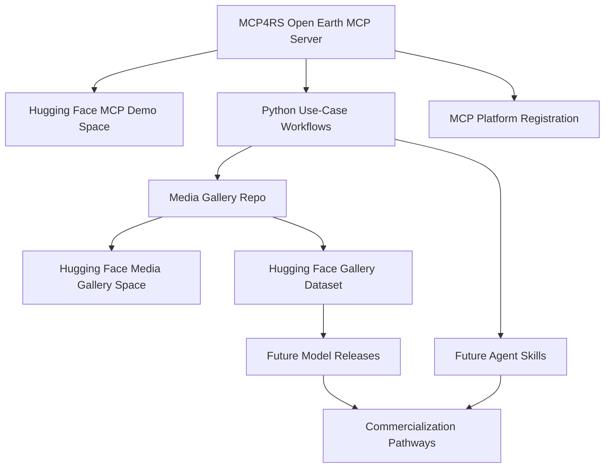

# MCP4RS Open Earth Ecosystem

A public roadmap and asset map for the MCP4RS Open Earth ecosystem: MCP server,
reproducible media gallery, Hugging Face demos, datasets, future Agent Skills,
model releases, MCP registry distribution, and commercialization pathways.

## Core Assets

| Asset | Link | Role |
| --- | --- | --- |
| MCP Server Repo | https://github.com/MCP4RemoteSensing/mcp4rs-open-earth | Core MCP server, Gradio app, stdio server, and MCP endpoint. |
| MCP Demo Space | https://huggingface.co/spaces/zlysunshine/mcp4rs-open-earth | Live MCP server demonstration through Hugging Face Spaces. |
| Media Gallery Repo | https://github.com/MCP4RemoteSensing/mcp4rs-media-gallery | Reproducible remote-sensing gallery workflow. |
| Media Gallery Space | https://huggingface.co/spaces/zlysunshine/mcp4rs-media-gallery | Live use-case gallery demonstration. |
| Media Gallery Dataset | https://huggingface.co/datasets/MCP4RemoteSensing/mcp4rs-media-gallery-outputs | Published gallery outputs and provenance metadata. |

## Ecosystem Roadmap



## Roadmap Documents

| File | Purpose |
| --- | --- |
| [ROADMAP.md](ROADMAP.md) | Full roadmap table and development stages. |
| [ASSET_MAP.md](ASSET_MAP.md) | All public ecosystem links. |
| [docs/AGENT_SKILLS_PLAN.md](docs/AGENT_SKILLS_PLAN.md) | Future plan for wrapping Python workflows as Agent Skills. |
| [docs/MODEL_RELEASE_PLAN.md](docs/MODEL_RELEASE_PLAN.md) | Future model fine-tuning and release plan. |
| [docs/MCP_PLATFORM_REGISTRATION.md](docs/MCP_PLATFORM_REGISTRATION.md) | MCP registry and platform distribution plan. |
| [docs/COMMERCIALIZATION_PLAN.md](docs/COMMERCIALIZATION_PLAN.md) | API, hosted workflow, and web3 token-economics paths. |

## Suggested Repository Description

```text
Public roadmap and asset map for the MCP4RS Open Earth ecosystem: MCP server,
Hugging Face demos, reproducible media gallery, datasets, future Agent Skills,
model releases, registry distribution, and commercialization paths.
```

## Suggested Topics

```text
mcp
remote-sensing
earth-observation
geospatial
open-data
huggingface
agent-skills
model-context-protocol
reproducible-research
ai-for-earth
```
