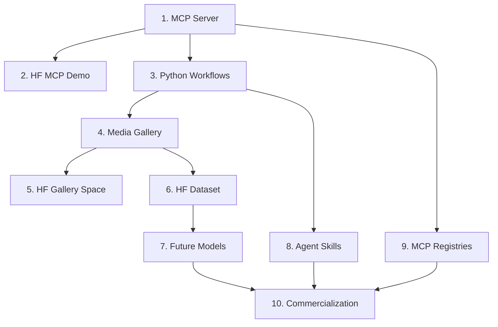

# MCP4RS Open Earth Roadmap

## Roadmap Table

| Stage | Component | Current Asset | Purpose | Status | Next Step |
| --- | --- | --- | --- | --- | --- |
| 1 | MCP Server | https://github.com/MCP4RemoteSensing/mcp4rs-open-earth | Core remote-sensing MCP tools for source discovery, analysis, and explanation. | MVP live | Expose and document all `server.py` tools. |
| 2 | MCP Demo Space | https://huggingface.co/spaces/zlysunshine/mcp4rs-open-earth | Demonstrates the MCP server through Hugging Face Gradio MCP support. | MVP live | Add clearer MCP endpoint and client setup docs. |
| 3 | Media Gallery Workflow | https://github.com/MCP4RemoteSensing/mcp4rs-media-gallery | Turns source queries into provenance JSON and rendered media. | MVP live | Connect live MCP calls in future. |
| 4 | Media Gallery Space | https://huggingface.co/spaces/zlysunshine/mcp4rs-media-gallery | Demonstrates practical use cases of MCP-enabled remote-sensing workflows. | MVP live | Improve gallery UX and provenance display. |
| 5 | Gallery Dataset | https://huggingface.co/datasets/MCP4RemoteSensing/mcp4rs-media-gallery-outputs | Publishes generated images, GIFs, and provenance records. | MVP live | Add metadata, limitations, and examples. |
| 6 | Agent Skills | Future repo or skill package | Wrap Python workflows as reusable agent-executable skills. | Planned | Define first skill: query to render to provenance report. |
| 7 | Model Releases | Future Hugging Face model repo | Fine-tune or adapt models using MCP-retrieved images and metadata. | Planned | Select base model and dataset scope. |
| 8 | MCP Registries | Official MCP Registry, GitHub MCP Registry, Glama, Smithery, PulseMCP, MCP.so, awesome lists | Make MCP4RS discoverable by agents and developers. | Planned | Prepare registry metadata package. |
| 9 | Commercialization | API gateway, hosted skills, enterprise deployment, token economics | Sustain the ecosystem while keeping open-science assets public. | Exploratory | Compare API pricing and web3 incentive models. |

## Roadmap Diagram

## Roadmap Narrative

MCP4RS Open Earth begins with a working MCP server for open remote-sensing data.
The server exposes tools for discovering, analyzing, and explaining Earth
observation sources. The Hugging Face MCP demo Space gives users a public web
entry point and an MCP-compatible demonstration surface.

The Media Gallery extends the server concept into reproducible workflows:
source discovery, provenance export, Python rendering, and generated images or
GIFs. The gallery outputs are published as a Hugging Face dataset so they can be
used in documentation, teaching, demos, and future model-release experiments.

The next layer is Agent Skills. These skills can wrap repeatable Python
workflows around MCP calls, validate provenance, and return reports or media.
Future model releases can fine-tune or adapt existing remote-sensing and
multimodal models using MCP-retrieved images and source metadata.

The ecosystem then expands through MCP registries and platform listings, while
commercialization can be explored through hosted API access, managed workflows,
enterprise deployment, and web3 token-economic mechanisms for credits,
provenance, contributor rewards, and governance.

## Immediate Priorities

| Priority | Work Item | Output |
| --- | --- | --- |
| P0 | Document all MCP server tools | Tool reference with inputs, outputs, use cases, and examples. |
| P0 | Link every public asset | Cross-links in GitHub READMEs, Hugging Face cards, and dataset cards. |
| P0 | Stabilize Hugging Face demo releases | Clear sync workflow and release checklist. |
| P1 | Prepare MCP registry package | Description, tags, screenshots, endpoint/package metadata, badges. |
| P1 | Define first Agent Skill | A reproducible query-render-report workflow. |
| P1 | Draft model release scope | Base model, dataset scope, evaluation task, model card requirements. |
| P2 | Explore commercialization | Hosted API, managed workflows, enterprise services, token economics. |
