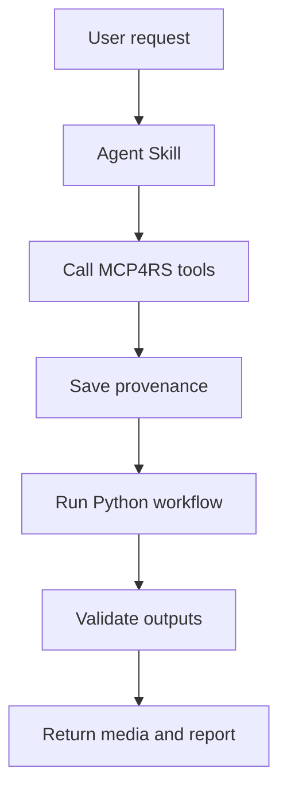

# Agent Skills Plan

The future Agent Skills layer will wrap repeatable MCP4RS workflows into
reusable agent-executable tasks.

## Candidate Skills

| Skill | MCP Inputs | Workflow | Output |
| --- | --- | --- | --- |
| Source Discovery Skill | bbox, date range, sensor, cloud threshold | Call MCP tools to search open remote-sensing catalogs. | STAC IDs, source URLs, provenance JSON. |
| Water Monitoring Skill | Sentinel-2 assets | Compute NDWI and water mask. | PNG, summary table, provenance. |
| Media Gallery Skill | use-case name, region, date range | Query sources, render figures, export metadata. | Gallery folder and report. |
| Provenance Report Skill | generated media path | Trace source URLs and processing records. | Markdown or JSON report. |
| Teaching Demo Skill | topic and dataset | Build reproducible notebook or demo. | Colab-ready tutorial. |

## Future Skill Flow



## First Skill Candidate

The first skill should be narrow and reproducible:

```text
Query open remote-sensing sources for a region and time range, save provenance,
render a simple gallery output, and return a Markdown report.
```

## Skill Requirements

| Requirement | Reason |
| --- | --- |
| Clear input schema | Agents need predictable parameters. |
| Provenance-first output | Every generated image should trace back to source metadata. |
| Local and hosted paths | Workflows should run in Codespaces, Colab, or hosted environments. |
| Human-readable report | Non-expert users need explanations, not only files. |
| Failure handling | Remote catalogs and large assets can fail or time out. |

## Possible Skill Package Structure

```text
mcp4rs-agent-skills/
  README.md
  skills/
    source-discovery/
      SKILL.md
    media-gallery/
      SKILL.md
    provenance-report/
      SKILL.md
  examples/
    water-monitoring.md
    gallery-generation.md
```
