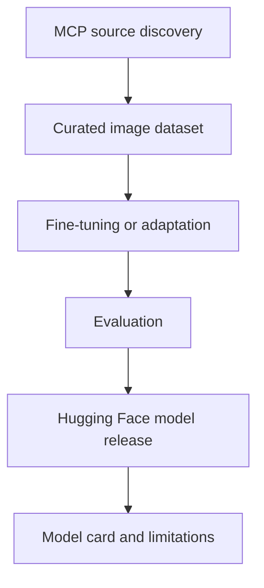

# Model Release Plan

Future MCP4RS model releases can use images and metadata retrieved through MCP
workflows.

## Model Roadmap

| Stage | Description | Output |
| --- | --- | --- |
| Data selection | Use MCP tools to retrieve remote-sensing images and metadata. | Curated dataset with provenance. |
| Baseline model | Select an existing remote-sensing or multimodal model. | Baseline evaluation. |
| Fine-tuning | Fine-tune or adapt the model using MCP-retrieved data. | Model checkpoint. |
| Evaluation | Evaluate on remote-sensing tasks such as classification, segmentation, or retrieval. | Metrics and examples. |
| Release | Publish on Hugging Face with model card and responsible-use notes. | Public model repo. |

## Candidate Model Directions

| Direction | Example Task | Data Source |
| --- | --- | --- |
| Image classification | Land cover or scene category recognition. | MCP-retrieved optical imagery and labels. |
| Segmentation | Water, vegetation, or land-cover masks. | Sentinel-2 derived indices and masks. |
| Retrieval | Match text queries to remote-sensing scenes. | Gallery images and captions. |
| Multimodal explanation | Explain observed Earth patterns from imagery and metadata. | Images plus provenance records. |

## Required Release Metadata

| Item | Purpose |
| --- | --- |
| Data provenance | Explain where images came from. |
| Intended use | Define educational, research, or demo use. |
| Non-intended use | Avoid operational or safety-critical misuse. |
| Evaluation | Report limitations and benchmark scope. |
| License | Clarify reuse conditions. |
| Citation | Credit source datasets, tools, and the MCP4RS repositories. |

## Release Diagram

